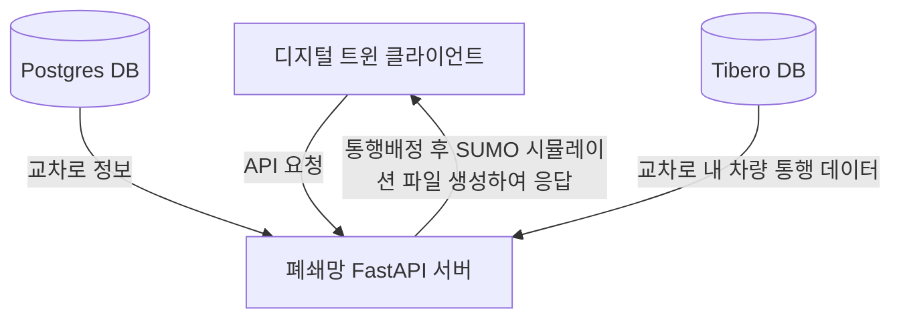
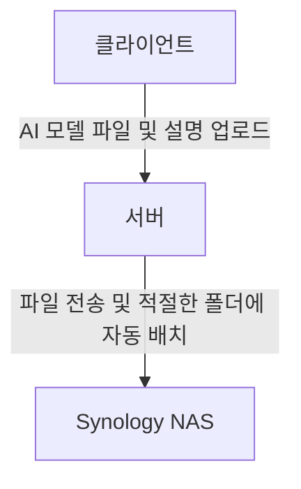

# 정호진 - 경력기술서

## 경력1. 주식회사 글로벌브릿지

### 2023년 인천광역시 지능형교통체계(ITS) 구축용역: 인천시 서구 통행배정/신호배정 API 서버 개발

### 프로젝트 요약

현실 교차로 데이터를 받아 디지털 트윈 시뮬레이션을 구현의 일환으로 시뮬레이션에 들어가는 차량 데이터를 가공하는 API 서버를 만들고자 하는 프로젝트.

-----

| 구분 | 내용 |
|---|---|
| **프로젝트명** | 통행배정/신호배정 API 서버 개발 |
| **진행 기간** | 2024.8 \~ 2025.4 (9개월) |
| **참가 인원, 역할, 기여도** | **프로젝트 리드: 본인 1명 (80%)** 협업 및 보조: 1명 (20%) |
| **사용 스택 (백엔드)** |   |
| **사용 스택 (시뮬레이션/데이터)** |    |
| **사용 스택 (인프라)** |  |

-----

### 프로젝트 개요

<SUMO 시뮬레이션 예시, [이미지 출처](https://youtu.be/ccc2mnGX_Mg?t=3719)>

인천교통센터 **ITS** 디지털트윈 프로젝트의 일환. API 요청을 받으면 인천시 서구 370개 이상의 교차로로부터 각 차량들의 통행 정보를 받아 그를 토대로 **통행배정**을 시행, 위 예시 이미지와 같은 시뮬레이션, 그것도 차량 및 교차로 신호등 데이터를 포함한 시뮬레이션이 실행될 수 있게 해주는 파일을 응답해주는 서버를 **폐쇄망** 환경에 맞게 개발하는 것이 목표.

### 지능형교통체계(ITS)란?

**각 교차로에 설치된 스마트CCTV 와 AI 시각 모델을 사용해 얻는 교통 정보를 토대로 혼잡도 계산, 신호 최적화, 사고 알림 등의 편의성을 제공하는 시스템**

-----

### 통행배정이란?

**현실에서 인식된 차량들이 "어디에서 왔는지", 그리고 "어디로 갔는지" 를 추론하여 시뮬레이션에 차량으로서 적용시키는 과정.**
  
인천시 서구의 370개 이상의 각 교차로에서 오는 정보는 차량이 교차로 내부에서 어떻게 움직였는지 뿐, **해당 차량이 어디에서 왔고, 어디로 가는지에 대한 정보는 없음.**
하지만 그걸 그대로 디지털 트윈에 적용시키게 되면 차량은 **각 교차로 부분에만 존재**할 것이며, 교차로 사이사이의 도로들은 텅 비게 됨.
  
예시 이미지와 같이 **차량의 "흐름" 을 인공적으로나마 구현**하여 디지털 트윈의 기능성을 향상시켜주는 것이 목표.
  
-----

### 왜 폐쇄망을 상정하여 개발해야 했는지?

**보안 상 타 API 서버와의 격리가 필요하고, 인천교통센터 내부에서 LAN 으로 접속할 때만 접근 가능하도록 클라이언트인 인천교통센터가 요구함에 따라 그렇게 진행함.**

서버 점검 또는 소스 코드 수정 시에도 외부망에 의존하지 않아도 되도록 구현하고, 빌드 매뉴얼 또한 작성해야 했음.

-----

### 경험 및 성과
* **사내 누구도 써본 적 없고 모르는 DLR SUMO 기술을 가지고 성공적으로 통행배정 로직 개발**

| **문제 상황** | **해결** |
|---|---|
| 사내에 조언을 구할 사람도 없고, SUMO 사용 사례는 드물고, 공식 Documentation 이 매우 빈약함, 얼핏 보면 내용이 풍부해보이지만, "컴퓨터에는 CPU 가 들어있음" 과 같이 당연한 사실을 나열해두는 수준의 내용이 주를 이룸. 그러나 오픈소스 기술 중 SUMO 를 대체할 기술은 없음 | 누락되는 내용을 최소화하기 위해 영어 Documentation 을 읽었으며, 끈기를 가지고 소스 코드도 읽으며 그럴듯해보이는 함수들을 하나하나 시험해보며 프로젝트에 적합한 함수에 대한 전수조사를 함 |

* **최장 10분에서 Timeout 까지 걸리던 통행배정 계산 소요 시간을 4분 이하로 절감 및 실패율 0% 달성하여 끊김 없는 디지털 트윈 구현 성공**

| **문제 상황** | **해결** |
|---|---|
| 인천시 서구 370개 이상의 교차로로부터 초당 평균 약 60건 (분당 평균 약 3천건, 시간당 평균 약 20만건, 일당 평균 약 500만건) 의 차량 데이터가 들어옴. 실시간 시뮬레이션은 1분 단위로 끊기 때문에 부담이 되지 않으나, 과거 분석 시뮬레이션은 최대 5시간의 크기이기 때문에 통행배정 계산이 10분 이상 걸리거나 아예 Timeout 되는 경우가 발생 | Pandas 를 사용해 대용량 데이터의 처리 속도를 높였으며, 데이터 정제 과정에서 불필요한 데이터를 최대한 배제하고, 남은 데이터는 최대한 간략화하는 것으로 최적화. 5시간짜리 과거 분석 통행배정도 약 4분 만에 완료할 수 있게 됨 |

* **폐쇄망 환경에서의 빌드 시간 평균 20분에서 평균 2분으로 절감 및 누구든 원클릭으로 간편하게 빌드할 수 있도록 프로세스 간소화** 

| **문제** | **해결** |
|---|---|
| 외부망 컴퓨터에서 리눅스 패키지 파일 다운로드 -> 폐쇄망 컴퓨터로 패키지 파일들 옮기기 -> 패키지 파일들 가지고 의존성 및 프로젝트 빌드, 이 일련의 과정이 다운로드 받을 것도 많고, 의존성 빌드할 것도 많기 때문에 평균 20분이 소요됨. 빌드 관련 파일과 Linux 패키지 파일들을 모두 서버에 구비해두어도 다운로드만 안 해도 되지, 의존성도 매번 빌드해주어야 하기 때문에 평균 10분이 소요됨. | 외부망 컴퓨터에서 리눅스 패키지 파일 다운로드 -> 패키지 파일들 가지고 의존성 빌드한 결과물을 Docker 이미지로 제작 -> 생성된 이미지를 가지고 프로젝트만 따로 빌드하여 Docker 컨테이너 생성 빌드 과정에 일회성 작업을 넣음으로써 최초 Docker 이미지 제작 시 약 20분을 투자하면 그 이후부터는 프로젝트 빌드만 해도 되기에 약 2분 정도로 빌드가 가능하게 됨. 그 빌드 과정은 shell 스크립트로 작성해두었기 때문에 누구든 실행만 하면 끝. |

* **인천시 서구 도로 정보가 업데이트될 때마다 고유 식별 코드가 바뀌어 매핑에 1\~2시간이 소요되던 작업을 전용 Mapper 를 개발하여 소요 시간 1\~2분으로 절감 및 누구든 원클릭으로 간편하게 사용할 수 있도록 프로세스 간소화**

| **문제** | **해결** |
|---|---|
| 인천시 서구 도로 및 교차로는 RoadRunner 라는 프로그램을 통해 그려졌고, 그 결과물을 SUMO 가 사용하는 네트워크 파일로 변환해 사용함. 동일한 RoadRunner 파일이라도 사소한 변화가 하나라도 있으면 SUMO 네트워크 파일로 변환 시 교차로별 고유 식별 코드가 전부 바뀌어버려 매번 수동으로 1\~2시간씩 걸려서 매핑해주어야 하는 번거로움이 있었음. 경위도 수치에 의존해보려 했으나, 네트워크 파일의 경위도 수치의 오차값이 너무 커서 불가. | 고유 식별 코드 외에도 교차로의 4방면 도로의 각 각도라던지, 인접한 교차로의 이름이라던지 추가적인 식별 기준을 만들어 각 교차로를 정확히 식별할 수 있게 됨. 이 과정은 Python 파일 및 그걸 실행시키는 shell 스크립트로 작성해두었기 때문에 누구든 실행만 하면 끝. |

* **인수처가 요구한 모든 조건을 달성하여 차회 사업 낙찰에 직접적으로 기여**

프로젝트가 성공적으로 준공되어, 이후 타 구로 사업을 확장하게 될 때 성공적으로 회사가 다시금 낙찰에 성공하였음.
개발 과정에 있어 팀 내부든, 클라이언트와의 미팅이든, 논의가 필요할 때 적극적으로 참여하고 의견을 조율 및 수렴하였으며,
관공서 프로젝트에서 요구하는 수준의 자세한 매뉴얼 작성을 하여 프로젝트 준공에 직접적인 기여를 하였음.

-----

### 사내 업무 효율 개선 프로젝트: AI 모델 파일 관리 시스템 개발

### 프로젝트 요약

사내의 수많은 AI 학습 모델이 NAS 에 정서없이 흩어져있음. 이를 해결하기 위해 AI 학습 모델 파일을 업로드 시, 입력된 모델명과 용도에 따라 자동으로 분류해서 NAS 내 적절한 폴더에 저장해두는 시스템 및 그 프런트엔드 UI 를 만들기 위한 프로젝트.

-----

| 구분 | 내용 |
|---|---|
| **프로젝트명** | 사내 업무 효율 개선 프로젝트: AI 모델 파일 관리 시스템 개발 |
| **진행 기간** | 2024.4 \~ 2024.7 (4개월) |
| **참가 인원, 역할, 기여도** | **프런트엔드 리드 & 백엔드 보조: 본인 1명 (70%)** 백엔드 리드 & 프런트엔드 보조: 1명 (30%) |
| **사용 스택 (프런트엔드)** |       |
| **사용 스택 (백엔드)** |    |
| **사용 스택 (인프라)** |  |

-----

### 프로젝트 개요

사내 업무 효율 개선 프로젝트의 일환. AI 모델 학습 파일과 함께, 해당 파일이 무슨 프로젝트를 위한 것인지, 용도는 어떻고, 사용된 파라미터는 무엇인지 등을 입력하면 시스템이 알아서 적절한 위치에 파일을 저장하며, 입력된 파일의 상세 정보 또한 같이 JSON 파일로 저장되어 조회 및 수정이 가능해야 함. 이를 위한 프런트엔드 UI 를 사내 서버에 올려 간편하게 구글 드라이브처럼 사용할 수 있는 것이 목표.

-----

**문제 정의:** 기존 방식: NAS에 직접 접속하여 AI 모델 파일을 수작업으로 관리, 파일 명명 규칙과 파일 그룹이 일관되지 않아 파일 찾기 및 협업이 어려움. 파일이 늘어날수록 파일명 충돌, 중복 파일이 존재할 위험 증가, 이를 관리하기 위한 규칙 및 그걸 강제할 수 있는 시스템의 필요가 생김. 지속적인 개선 및 유지보수가 필요하기 때문에 코드 모듈화 필요.

**문제 해결:** Synology NAS API 를 활용해 AI 모델 파일 업로드·그룹핑·설명 첨부를 자동화하는 웹 시스템 구축. 구글 드라이브를 참고해 디자인 구현, 기능적으로는 브라우저 상에서의 폴더/파일 탐색, 이름 변경, 삭제 등 구현. Storybook 으로 컴포넌트 관리, linter 와 자동화 스크립트로 코드 품질과 커밋 메시지 규칙 유지.

**성과:** AI 모델 파일 업로드·수정·삭제 시 중복 파일·잘못된 분류 그룹과 같은 문제 발생 원천 차단. NAS 에 별도로 접속할 필요 없이 웹 시스템에서 간편히 파일 관리 가능, 업무 효율 및 관할 부서 의사 결정 속도 향상. Storybook 을 사용한 컴포넌트 모듈화와 더불어 스크립트를 사용한 배포 반자동화로 유지보수 효율 상승.

-----

## 경력2. Heyboss Technologies LLC.

-----

### 클라이언트 홈페이지 개발 및 배포

| 구분 | 내용 |
|---|---|
| **프로젝트명** | 클라이언트 홈페이지 개발 및 배포 |
| **진행 기간** | 2022.10 \~ 2022.12 (3개월) |
| **참가 인원, 역할, 기여도** | **프로젝트 리드 및 사수:** 1명 **프런트엔드:** 본인 1명 |
| **사용 스택 (프런트엔드)** |    |
| **사용 스택 (배포)** |  |

**문제 정의:** 사내 솔루션에 없는 맞춤형 기능과 디자인 요구사항이 다수 접수된 상황. 클라이언트 홈페이지에 대한 작업을 병렬로 2\~4개 진행해야 하는 상황 (재직 기간 동안 총 6개 참여).

**문제 해결:** 필요 기능에 맞춰 커스텀 컴포넌트 추가 개발, Storybook 을 사용한 테스트 및 리뷰 프로세스 별도 수립. AWS S3 를 사용해 정적 웹사이트 배포, GitHub 연동으로 디버깅 효율화.

**성과:** 6개 클라이언트 홈페이지 모두 성공적으로 론칭 및 긍정적 피드백 받음. 모듈화된 커스텀 컴포넌트 구현을 통해 프로젝트 간 자원 낭비 최소화 및 이후 프로젝트를 위한 기반을 다짐. 웹사이트 배포 반자동화를 통해 변경사항 발생·유지보수 시 빠른 대응 가능한 일련의 과정을 구현.

-----

### 사내 디자인 솔루션 컴포넌트 개발

| 구분 | 내용 |
|---|---|
| **프로젝트명** | 사내 디자인 솔루션 컴포넌트 개발 |
| **진행 기간** | 2022.6 \~ 2022.12 (7개월) |
| **참가 인원, 역할, 기여도** | **프로젝트 리드 및 사수:** 1명 **프런트엔드:** 본인 1명 |
| **사용 스택 (프런트엔드)** |    |
| **사용 스택 (디자인/협업)** |  |

<Storybook 예시, [이미지 출처](https://storybook.js.org/)>

**문제 정의:** 공통 컴포넌트 부족으로 매번 같은 기능을 재구현, 디자인 일관성 깨짐. 요구사항이 빈번하게 업데이트되는 환경에서 확장 가능하고 유연한 설계 필요. 작업량을 뒷받침하기 위해 채용된 신규 인턴에 대한 온보딩 필요.

**문제 해결:** React, Tailwind CSS 로 재사용 및 확장성을 고려하여 신규 작성 및 리팩토링, 총 50개 이상 컴포넌트를 작업. 매일 업무 시작 시 스탠드업 통해 변경사항 공유 및 회의 진행, Storybook 상에서 각 컴포넌트의 색상, 크기 등을 자유롭게 실험 가능하도록 구현. 팀원 1명 멘토링으로 코드 리뷰와 페어 프로그래밍 병행.

**성과:** 사내 솔루션 컴포넌트 2/3 이상 개발 및 관여, 모듈화 리팩토링을 통한 프런트엔드 개발 생산성 상승. Storybook 에 구현해둔 다양한 옵션들을 통해 디자인 검토가 용이해지고, 디자인 변경 결과 즉시 확인 가능, QA 부담 감소 및 의사 결정 속도 향상. 멘토링 효과로 팀 전체 작업 속도와 역량 상승.
