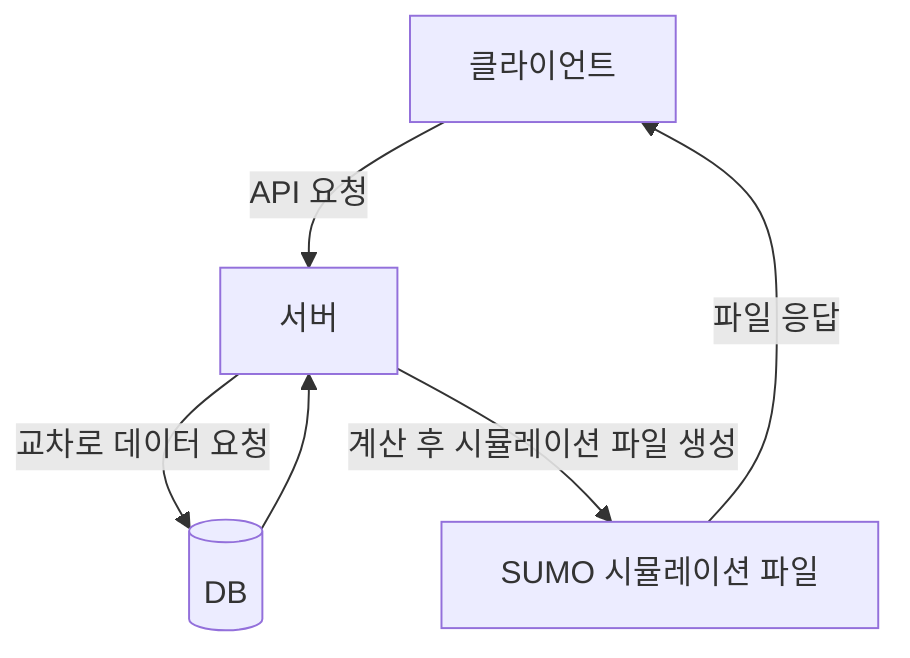
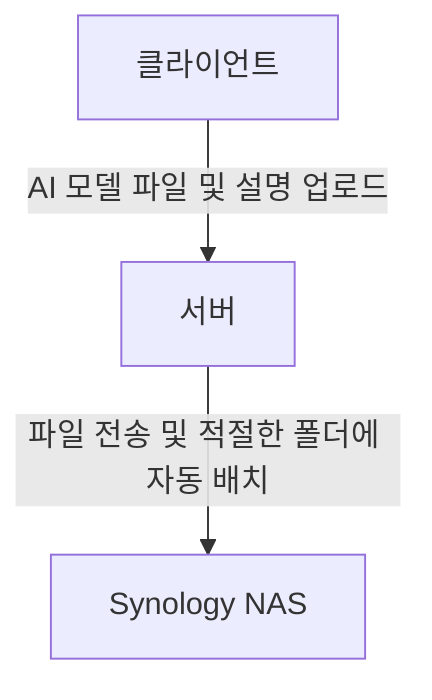
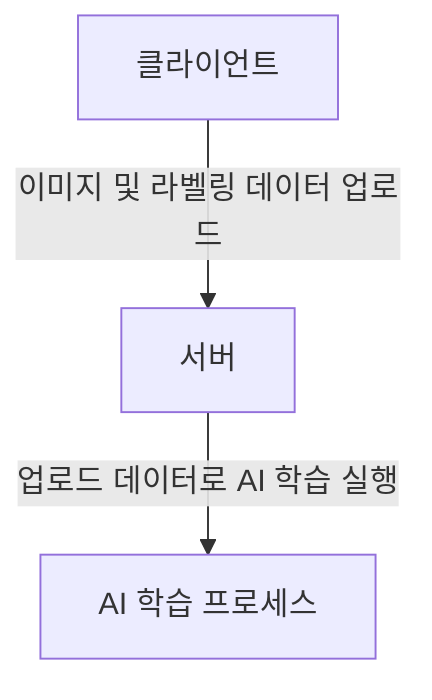

# 정호진 경력기술서

## 경력1. 주식회사 글로벌브릿지

-----

### 2023년 인천광역시 지능형교통체계(ITS) 구축용역: 인천시 서구 통행배정/신호배정 API 서버 개발

| 구분 | 내용 |
|---|---|
| **프로젝트명** | 통행배정/신호배정 API 서버 개발 |
| **진행 기간** | 2024.8 \~ 2025.4 (9개월) |
| **참가 인원 및 역할** | **프로젝트 리드:** 본인 1명 **협업 및 보조:** 1명 |
| **사용 스택 (백엔드)** |   |
| **사용 스택 (시뮬레이션/데이터)** |    |
| **사용 스택 (인프라)** |  |

<SUMO 시뮬레이션 예시, [이미지 출처](https://youtu.be/ccc2mnGX_Mg?t=3719)>

**문제 정의:** 마땅한 참고 사례나 자료도 매우 부족한 상황, 일일 500만 건 이상의 데이터가 들어오는 엔터프라이즈급 DB의 내용만을 가지고 해당 데이터들을 실시간으로 수집·처리하여 시뮬레이션용 기초 데이터를 생성해야 함. 교차로별 시뮬레이션(통행/신호) 과정이 복잡, 지리 네트워크 버전업 때마다 각 교차로 ID 가 바뀌어 차량과 신호가 제대로 매핑되지 않는 문제 발생. 외부망(인터넷) 연결이 없는 리눅스 서버에서 소스 코드 변경 시 자체적으로 빌드·배포 모두가 가능하도록 구현해야 함.

**문제 해결:** Python FastAPI 를 사용한 API 서버 구축, 수백만 건의 데이터의 원활한 처리를 위해 Pandas 사용. 오픈소스 DLR SUMO 로 인천광역시 서구 전체 도로·교차로 시뮬레이션 구현, DB 에 들어오는 데이터 기반 자동으로 실시간 현실 반영 구현. 지리 네트워크 버전업 때마다 교차로 ID 가 변경되는 문제 해결을 위해 전용 Mapper 를 구현해 수동 매핑 리스크 제거. 외부망(인터넷) 연결이 없는 상태에서도 자체적으로 빌드 및 배포가 이루어질 수 있게 전용 Docker 이미지 생성 및 그 과정을 스크립트로 반자동화.

**성과:** 실시간 교통 데이터 기반 시뮬레이션 구현에 크게 일조함으로써 프로젝트 성공에 직접적으로 기여. Mapper 를 만들어 지리 네트워크 버전업 때 발생하는 반복 작업 최소화, 업무 효율 및 관할 부서 의사 결정 속도 향상. 소스 코드 변경 시 외부망(인터넷) 에 대한 의존 없이, 그리고 스크립트 하나를 실행하는 것만으로 빌드·배포가 한꺼번에 이루어지는 단순한 과정 구현, 업무 효율 향상 및 인수처 요구 달성.

-----

### 사내 업무 효율 개선 프로젝트: AI 모델 파일 관리 시스템 개발

| 구분 | 내용 |
|---|---|
| **프로젝트명** | 사내 업무 효율 개선 프로젝트: AI 모델 파일 관리 시스템 개발 |
| **진행 기간** | 2024.4 \~ 2024.7 (4개월) |
| **참가 인원 및 역할** | **프런트엔드 리드 & 백엔드 보조:** 본인 1명 **백엔드 리드 & 프런트엔드 보조:** 1명 |
| **사용 스택 (프런트엔드)** |       |
| **사용 스택 (백엔드)** |    |
| **사용 스택 (인프라)** |  |

**문제 정의:** 기존 방식: NAS에 직접 접속하여 AI 모델 파일을 수작업으로 관리, 파일 명명 규칙과 파일 그룹이 일관되지 않아 파일 찾기 및 협업이 어려움. 파일이 늘어날수록 파일명 충돌, 중복 파일이 존재할 위험 증가, 이를 관리하기 위한 규칙 및 그걸 강제할 수 있는 시스템의 필요가 생김. 지속적인 개선 및 유지보수가 필요하기 때문에 코드 모듈화 필요.

**문제 해결:** Synology NAS API 를 활용해 AI 모델 파일 업로드·그룹핑·설명 첨부를 자동화하는 웹 시스템 구축. 구글 드라이브를 참고해 디자인 구현, 기능적으로는 브라우저 상에서의 폴더/파일 탐색, 이름 변경, 삭제 등 구현. Storybook 으로 컴포넌트 관리, linter 와 자동화 스크립트로 코드 품질과 커밋 메시지 규칙 유지.

**성과:** AI 모델 파일 업로드·수정·삭제 시 중복 파일·잘못된 분류 그룹과 같은 문제 발생 원천 차단. NAS 에 별도로 접속할 필요 없이 웹 시스템에서 간편히 파일 관리 가능, 업무 효율 및 관할 부서 의사 결정 속도 향상. Storybook 을 사용한 컴포넌트 모듈화와 더불어 스크립트를 사용한 배포 반자동화로 유지보수 효율 상승.

-----

### 2023 인천광역시 동구 선별관제 용역: AI 학습용 라벨링 웹페이지 개발

| 구분 | 내용 |
|---|---|
| **프로젝트명** | 2023 인천광역시 동구 선별관제 용역: AI 학습용 라벨링 웹페이지 개발 |
| **진행 기간** | 2023.10 \~ 2023.12 (3개월) |
| **참가 인원 및 역할** | **라벨링 웹페이지 개발:** 본인 1명 **라벨링 웹페이지를 기존 대시보드와 연결:** 1명 **백엔드 API 연동:** 1명 |
| **사용 스택 (프런트엔드)** |      |
| **사용 스택 (백엔드)** |  |
| **사용 스택 (캔버스 로직)** |  |

**문제 정의:** 기존 방식: 사내에서 선별관제용으로 사용하는 AI 모델용 라벨링 데이터를 직접 별도의 프로그램으로 작성 후 서버에 수동으로 업로드. 라벨링 규칙은 정형화되어 있으나, 별도의 프로그램을 사용하며 해당 규칙을 매번 설정해줘야 하는 점, 이후 데이터 수동 업로드 시 호환성을 맞추기 위해 들어가는 노력 등, 업무 효율이 저하되는 문제 발생. 서버 내에서 사전 정의된 라벨링 규칙을 자동 적용, 라벨링 실시, 데이터 저장을 한꺼번에 할 수 있는 웹페이지가 필요.

**문제 해결:** 오픈소스 Label Studio 라이브러리 기반으로 요구사항에 맞게 커스터마이징된 라벨링 웹페이지 개발. 복장인식, 사람검지, 이상행동 3개 라벨링 규칙 구현, 슬라이더 메뉴 하나만으로 각 규칙들을 바로 적용하여 라벨링을 할 수 있도록 구현. 완성된 라벨링 데이터를 REST API 를 통해 서버에 전송.

**성과:** 라벨링 작업에 있어 라벨링 규칙 설정 과정 배제, 라벨링 규칙 변경 용이와 같은 개선점을 통해 작업 효율 향상. 라벨링 완성 후 버튼 클릭 한번만으로 데이터가 자동으로 호환성이 맞춰지고 서버에 저장되기 때문에 작업 효율 향상 및 데이터 호환성·품질 균일 유지.

-----

### 사내 업무 효율 개선 프로젝트: AI 모델용 ROI 기록 웹 툴 개발

| 구분 | 내용 |
|---|---|
| **프로젝트명** | 사내 업무 효율 개선 프로젝트: AI 모델용 ROI 기록 웹 툴 개발 |
| **진행 기간** | 2023.8 \~ 2023.10 (3개월) |
| **참가 인원 및 역할** | **프로젝트 리드 & 프런트엔드:** 본인 1명 |
| **사용 스택 (프런트엔드)** |      |
| **사용 스택 (캔버스 도형 로직)** |  |
| **사용 스택 (배포)** |  |

**문제 정의:** 기존 방식: 이전에 사내용으로 개발된 윈도우 응용 프로그램을 사용해 ROI 를 로컬에서 그린 후 각 교통카메라를 관리하는 엣지 컴퓨터에 업로드. 윈도우 이외의 OS 에선 ROI 작업이 불가하며, 대부분 과정이 수동으로 이루어지는 것과 더불어 복잡해 실수 가능성이 높고, 상황에 따라 기능 조정이 불가하여 사용하기 어려움. ROI 규칙을 간편히 정의·수정할 수 있고, ROI 를 그리는 과정 중 인간 에러를 최대한 배제할 수 있게 가이드해주는 웹 툴이 필요.

**문제 해결:** 오픈소스 OpenLayers 라이브러리 기반으로 요구사항에 맞게 커스터마이징된 ROI 캔버스 웹사이트 개발 후 배포. 유저의 실수나 이상행동을 최소화하기 위해 모든 과정에 가이드, 안전장치, 데이터 보정을 구현. 사용하는 상황에 맞춰 필요한 기능만을 제공하도록 JSON 설정 파일을 통한 다양한 모드 설정 제공.

**성과:** ROI 작성 과정 중 안전장치와 데이터 보정을 통해 사용자가 취해야 할 단계 대폭 감소, 작업 편의성 향상 및 작업 속도 1.5\~2배 향상 효과. 기존 ROI 규칙 수정 및 신규 규칙 추가 시 설정 파일을 조금만 수정하면 되므로 확장 및 유지보수 용이.

-----

## 경력2. Heyboss Technologies LLC.

-----

### 클라이언트 홈페이지 개발 및 배포

| 구분 | 내용 |
|---|---|
| **프로젝트명** | 클라이언트 홈페이지 개발 및 배포 |
| **진행 기간** | 2022.10 \~ 2022.12 (3개월) |
| **참가 인원 및 역할** | **프로젝트 리드 및 사수:** 1명 **프런트엔드:** 본인 1명 |
| **사용 스택 (프런트엔드)** |    |
| **사용 스택 (배포)** |  |

**문제 정의:** 사내 솔루션에 없는 맞춤형 기능과 디자인 요구사항이 다수 접수된 상황. 클라이언트 홈페이지에 대한 작업을 병렬로 2\~4개 진행해야 하는 상황 (재직 기간 동안 총 6개 참여).

**문제 해결:** 필요 기능에 맞춰 커스텀 컴포넌트 추가 개발, Storybook 을 사용한 테스트 및 리뷰 프로세스 별도 수립. AWS S3 를 사용해 정적 웹사이트 배포, GitHub 연동으로 디버깅 효율화.

**성과:** 6개 클라이언트 홈페이지 모두 성공적으로 론칭 및 긍정적 피드백 받음. 모듈화된 커스텀 컴포넌트 구현을 통해 프로젝트 간 자원 낭비 최소화 및 이후 프로젝트를 위한 기반을 다짐. 웹사이트 배포 반자동화를 통해 변경사항 발생·유지보수 시 빠른 대응 가능한 일련의 과정을 구현.

-----

### 사내 디자인 솔루션 컴포넌트 개발

| 구분 | 내용 |
|---|---|
| **프로젝트명** | 사내 디자인 솔루션 컴포넌트 개발 |
| **진행 기간** | 2022.6 \~ 2022.12 (7개월) |
| **참가 인원 및 역할** | **프로젝트 리드 및 사수:** 1명 **프런트엔드:** 본인 1명 |
| **사용 스택 (프런트엔드)** |    |
| **사용 스택 (디자인/협업)** |  |

<Storybook 예시, [이미지 출처](https://storybook.js.org/)>

**문제 정의:** 공통 컴포넌트 부족으로 매번 같은 기능을 재구현, 디자인 일관성 깨짐. 요구사항이 빈번하게 업데이트되는 환경에서 확장 가능하고 유연한 설계 필요. 작업량을 뒷받침하기 위해 채용된 신규 인턴에 대한 온보딩 필요.

**문제 해결:** React, Tailwind CSS 로 재사용 및 확장성을 고려하여 신규 작성 및 리팩토링, 총 50개 이상 컴포넌트를 작업. 매일 업무 시작 시 스탠드업 통해 변경사항 공유 및 회의 진행, Storybook 상에서 각 컴포넌트의 색상, 크기 등을 자유롭게 실험 가능하도록 구현. 팀원 1명 멘토링으로 코드 리뷰와 페어 프로그래밍 병행.

**성과:** 사내 솔루션 컴포넌트 2/3 이상 개발 및 관여, 모듈화 리팩토링을 통한 프런트엔드 개발 생산성 상승. Storybook 에 구현해둔 다양한 옵션들을 통해 디자인 검토가 용이해지고, 디자인 변경 결과 즉시 확인 가능, QA 부담 감소 및 의사 결정 속도 향상. 멘토링 효과로 팀 전체 작업 속도와 역량 상승.
